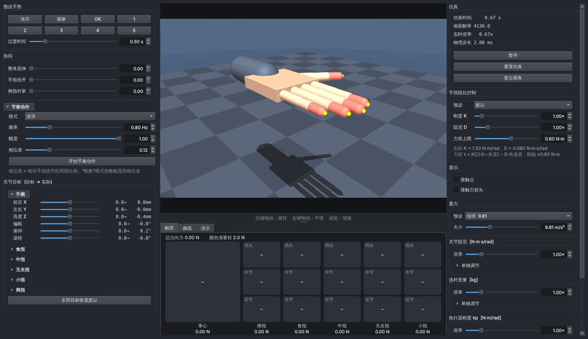
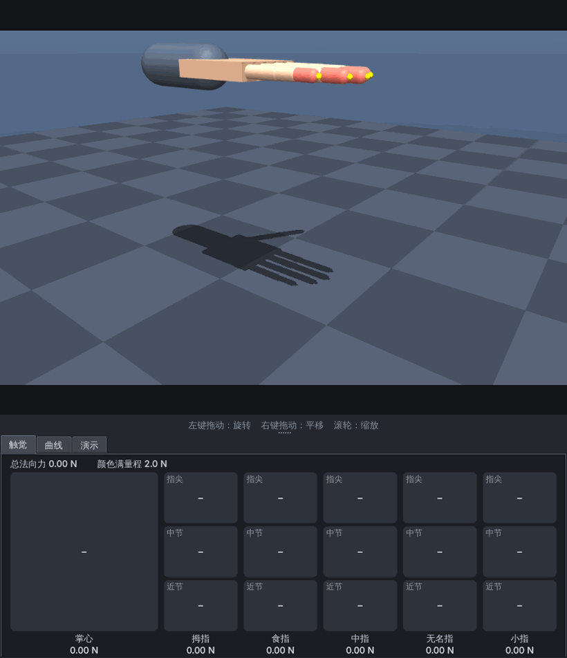
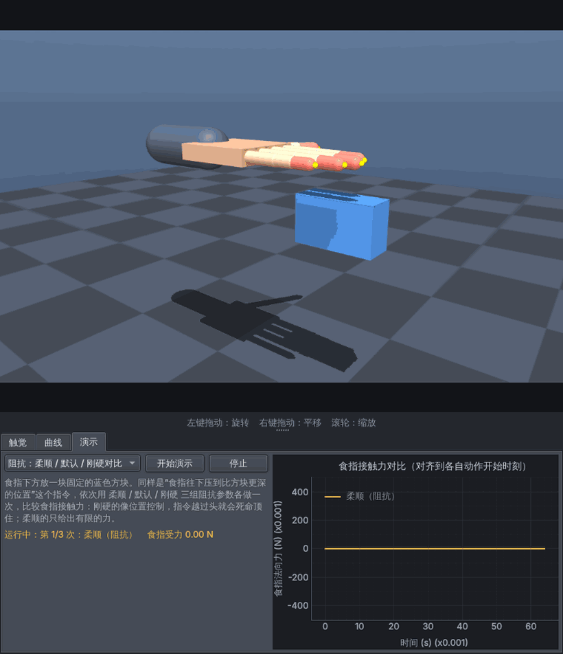
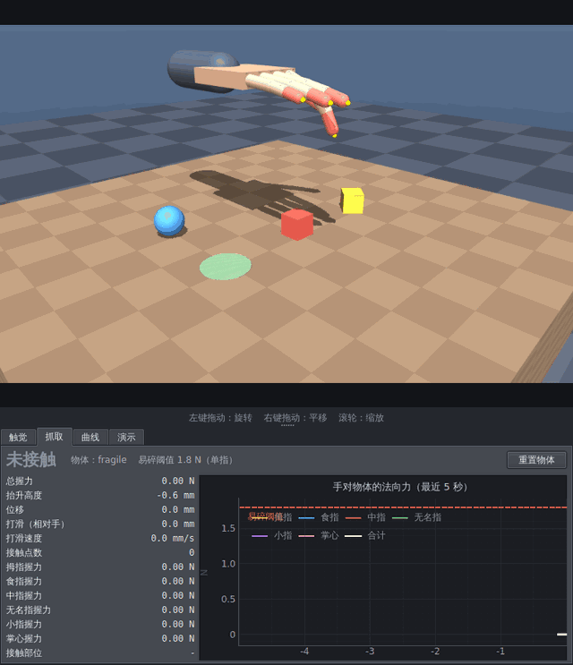
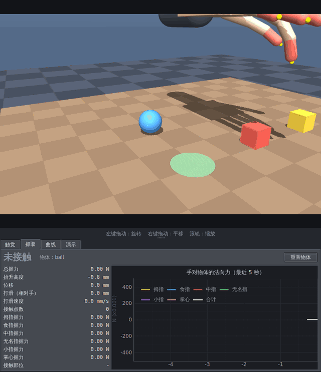
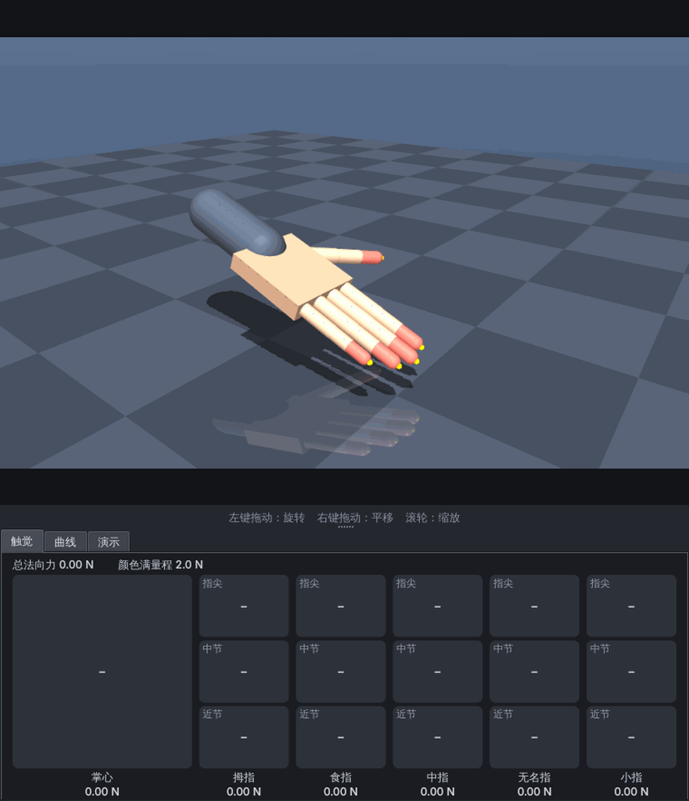
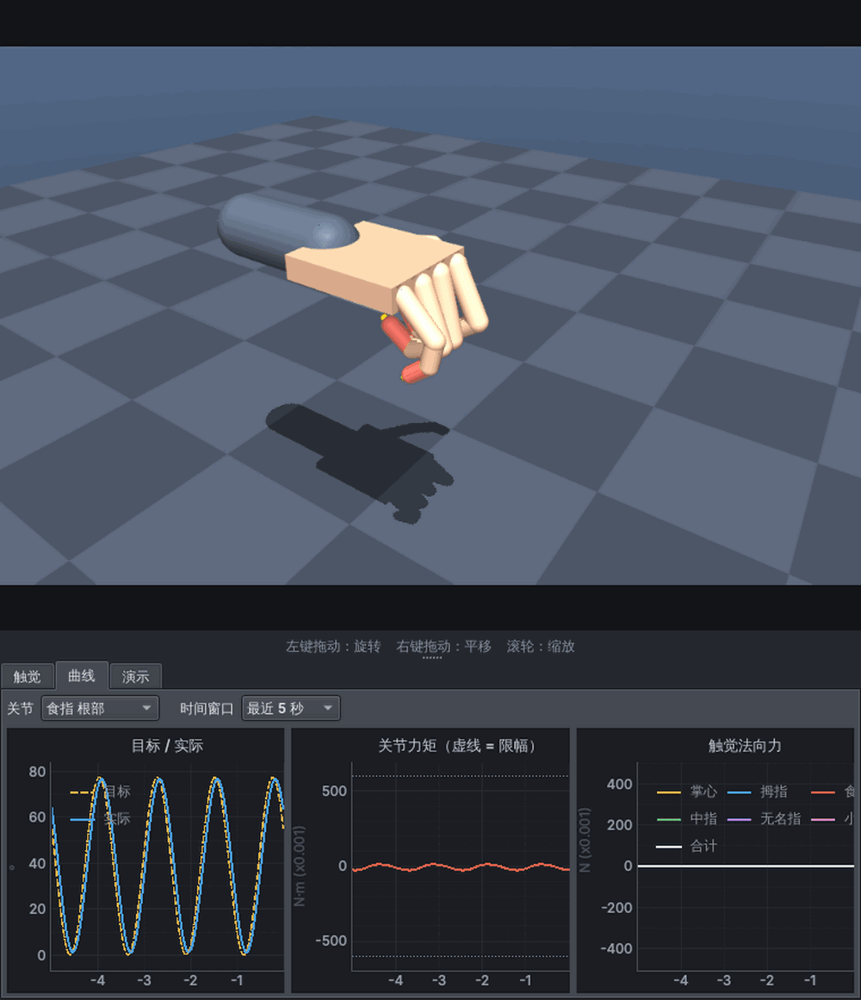

<div align="center">

# 🖐️ MyFirstMuJoCo

**纯 Python 的灵巧手仿真演示：MuJoCo + PySide6**
五指灵巧手（20 个手指自由度）· 6 自由度可移动手腕 · 关节阻抗控制 · 全手分段触觉 · 抓取指标 · 实时曲线 · 一键演示




<sub>预设手势（张开 / 握拳 / OK / 数字）与手指节奏动作，左侧滑块跟着同步。全部录自真实界面。</sub>

</div>

## ✨ 亮点

- **手指是力矩执行器，控制律在 Python 里算**：`τ = K·(目标角 − 当前角) − D·角速度`，限幅后写进执行器。刚度、阻尼、力矩上限实时可调，可以直接对比柔顺控制和位置控制
- **全手分段三维触觉**：掌心 + 五指共 16 段，每段的法向力、合力、接触点；界面里能看到每一节的受力，也能在 3D 画面上叠加接触点和力箭头
- **桌面抓取 + 量化指标**：拇指食指捏取序列（靠近→下降→力终止闭合→抬起→搬运→放下→松开），
  实时给出各指握力、抬升、相对手的打滑、接触统计和"抓牢 / 滑落 / 碎了"等判定
- **一键演示**：每个演示自带"运行状态 + 结果总结 + 对比曲线"，写新演示只要继承一个 `Demo` 类
- **核心与界面分离**：仿真核心不依赖 Qt，可以无界面批量跑；换手模型只需要 XML + 一个 `*_extras.py`，界面代码不用改
- **控制周期与物理步长分开**（零阶保持），结构和单片机定时控制环一致，方便以后把单片机控制逻辑用 Python 重写进来

## 🎬 演示

<table>
<tr>
<td align="center" width="50%"><b>触觉：按压桌面</b><br><sub>手腕按总力闭环下压：先指尖，再放平手掌（掌心承力）</sub><br></td>
<td align="center" width="50%"><b>阻抗：柔顺 / 默认 / 刚硬对比</b><br><sub>同一个"压到更深"的指令，三组阻抗参数，食指接触力差 5 倍</sub><br></td>
</tr>
<tr>
<td align="center" width="50%"><b>抓取：轻拿轻放易碎物</b><br><sub>同一套捏取动作：柔顺 1.0 N 搬到放置区；刚硬 3.0 N 单指冲到 3.3 N，易碎物变红（2 倍速）</sub><br></td>
<td align="center" width="50%"><b>抓取：位置控制 vs 阻抗控制抓球</b><br><sub>两组控制 × 定位误差 0/4/8 mm；实测柔顺反而把球推得更远（4 倍速）</sub><br></td>
</tr>
</table>

<table>
<tr>
<td align="center" width="50%"><br><sub>触觉页签：指尖按压时只有四根指尖受力</sub></td>
<td align="center" width="50%"><br><sub>曲线页签：目标/实际角度、力矩（虚线为限幅）、各指触觉力</sub></td>
</tr>
</table>

## 🚀 快速开始


```powershell
cd MyFirstMuJoCo
python -m venv .venv
.venv\Scripts\activate          # PowerShell 若提示禁止脚本：Set-ExecutionPolicy -Scope Process Bypass
pip install -r requirements.txt
python main.py
```

**桌面抓取场景**（桌子 + 方块 + 易碎方块 + 球，"抓取"页签和两个抓取演示都在这里）：

```powershell
python main.py --model app/scenes/hand/hand_table.xml
```

换模型：`python main.py --model app/scenes/arm/arm.xml`（3 自由度机械臂，里程碑 1 的场景仍可用）。
只要模型里有驱动关节的 `<position>` 执行器，左侧会自动生成对应滑块；关节名前缀相同的会自动分组。

## 操作

**左栏**
- **预设手势**：张开 / 握拳 / OK / 数字 1~5，点一下平滑过渡，"过渡时间"可调（0 = 立即）
- **协同**：整体屈伸、手指张开、拇指对掌，三个滑块组合出各种手形
- **节奏动作**：波浪 / 数数 / 敲击，频率、幅度、相位差实时可调，"开始/停止"切换
  （停止时手指保持在当前姿态，不会跳变；数数模式忽略幅度和相位差）
- **关节目标**：手腕（默认展开）和五指（点标题展开）逐关节微调。每行显示"目标→实际"，
  手腕的前后/左右/高度单位是毫米，其余是度
- 手势、协同、节奏、关节滑块互相同步：点手势后滑块会跟着动

**中间** 左键旋转，右键平移，滚轮缩放；右栏"复位视角"回到初始视角。下方页签（分隔条可拖动调高度）：
- **触觉**：每根手指 3 节（指尖在上）+ 掌心，颜色和数字是该段的法向力（N），自动量程
- **抓取**（只在桌面场景）：判定状态大字（抓牢=绿，碎了/滑落=红）、总握力和各指握力、抬升高度、位移、
  相对手的打滑和打滑速度、接触点数/接触部位；右边是最近 5 秒各指握力曲线（易碎物有阈值虚线）；"重置物体"按钮
- **曲线**：选一个关节，看 目标/实际角度、关节力矩（虚线 = 力矩限幅）、各手指触觉法向力，时间窗口 2~20 秒
- **演示**：选一个演示，开始/停止；运行中显示状态，结束后给出文字总结和可对比的曲线

**右栏**
- 暂停 / 重置仿真
- **手指阻抗控制**：预设（柔顺 / 默认 / 刚硬≈位置控制）或自己调 刚度 K、阻尼 D、力矩上限
- **显示**：接触点、接触力箭头（叠加在 3D 画面上）
- 重力、关节阻尼、连杆质量、执行器 kp/kv（倍率 + 逐个调节）

## 手指阻抗控制与触觉

- 手指执行器是**力矩型**（`<motor>`）。每个控制周期由 Python 计算
  `τ = K·(目标角 − 当前角) − D·角速度`，再限幅到 ±力矩上限，写进 `data.ctrl`
  （零阶保持，和单片机的定时控制环一样）。手腕仍是位置执行器，原样透传目标
- K 小 + 力矩上限小 = 柔顺：顶到东西时给出的力有限；K 大 = 接近位置控制：指令越过头就死命顶
- 触觉：把 MuJoCo 的每个接触力（`mj_contactForce`）换到世界系，按"手的哪一段"汇总成三维力；
  法向力永远 ≥ 0，另有接触点个数和（用于画箭头的）接触点位置

## 抓取指标（app/core/grasp.py）

只统计"手 ↔ 目标物体"的接触（`TactileSensor.read_against`，手压桌子不算握力），每个控制周期更新：

| 指标 | 含义 |
|---|---|
| 总握力 / 各指握力 | 手各段对物体的法向力之和 (N) |
| 抬升 | 物体高度 − 静止高度 |
| 位移 / 打滑 | 从"建立抓取"（总握力 ≥ 0.5 N、至少两处接触、持续 50 ms）起物体的位移；打滑是在**掌坐标系**里的位移（手带着物体动不算） |
| 判定 | 碎了 > 滑落 > 抓牢 > 抬起 > 接触 > 未接触；阈值集中在 `Thresholds` |

易碎物：任一手指对它的力 > 阈值并持续 20 ms 就判"碎了"（变红并锁存，重置后还原）。

桌面场景开了 MuJoCo 的 noslip 求解器：默认软摩擦会"蠕滑"，捏住的方块抬起后 1~3 秒就滑掉了（见 docs/NEXT_STAGE_B.md 附录 A）。

## 演示

| 演示 | 场景 | 看什么 |
|---|---|---|
| 触觉：按压桌面 | 手 | 手腕下压由总法向力闭环控制：先指尖按压（4 段受力），再放平手掌（掌心承力）。触觉页签实时显示每一节受力 |
| 阻抗：柔顺 / 默认 / 刚硬对比 | 手、桌面 | 食指下方放一块固定方块，同样"压到更深"的指令依次用三组阻抗参数各做一次，叠加比较食指接触力 |
| 抓取：轻拿轻放易碎物 | 桌面 | 同一套捏取动作做两次：柔顺阻抗 + 目标力 1.0 N 把黄色易碎方块搬到绿色放置区（成功，单指峰值 1.1 N，放置误差约 5 mm）；刚硬 + 3.0 N 单指冲到 3.3 N，超过 1.8 N 阈值，方块变红 |
| 抓取：位置控制 vs 阻抗控制抓球 | 桌面 | 刚硬 / 柔顺 × 手腕沿捏取轴偏 0/4/8 mm，共 6 次，比较冲击峰值、稳态握力、球被推开的距离。实测 6 次都抓牢；**柔顺反而推得更远**（偏 8 mm 时 20.5 mm vs 9.6 mm），冲击峰值两组相同（闭合是低速 + 力终止） |

新演示：继承 `app/core/demo.py` 的 `Demo`，在 `hand_extras.create()`（或 `hand_table_extras.create()`）的 `demos=[...]` 里登记即可；
需要物体的演示设 `needs_object = True`，在没有物体的场景里按钮会灰掉。

**关于"抓球"**：原计划若平桌面上的球捏不稳就换成圆柱（决策门 G1）。实测平桌面捏不住球主要是软摩擦蠕滑造成的，
开 noslip 后原来的捏取姿态就能 5/5 捏起球；试过的三种改进（水平对齐的 IK 姿态族、球座、滚动阻尼）和圆柱，
在"手按名义位置、球实际偏 ±1 cm"时都是 2~3/5（失败都是垂直于捏取轴偏约 7 mm），圆柱并不比球好，所以保留球。
详细数据：docs/NEXT_STAGE_B.md 附录 A，复现：`python tools/g1_ball_gate.py`。

## 手模型约定（app/scenes/hand/hand.xml）

- 手腕零位：手指沿 +x，拇指在 +y 侧，**手掌朝下**；手腕离地 0.30 m
- 手指/拇指弯曲轴为 +y，正方向 = 朝手掌弯曲
- 手腕：3 个平移 + 3 个旋转，全是位置执行器（高刚度），手腕这串刚体开了重力补偿，手不会下沉
- 手内部的几何体互不碰撞（只和地面/物体碰撞），避免握拳时卡住

## 目录

```
main.py                        入口（默认加载灵巧手）
app/core/                      仿真核心（不依赖 Qt，可无界面运行）
  sim.py                       加载模型、按真实时间推进、控制链（演示→控制器→阻抗→触觉→抓取指标→示波器）
  impedance.py                 关节阻抗：目标角 → 力矩
  tactile.py                   分段三维触觉（接触力按手的各段汇总；read_against 只统计与指定刚体的接触）
  grasp.py                     抓取指标与判定（握力、抬升、打滑、易碎）
  scope.py                     环形缓冲示波器（曲线页签和演示统计的数据来源）
  demo.py                      演示脚本基类
  params.py                    从模型自省出执行器规格（单位、分组）
  physics.py                   可在线调节的物理参数（重力/阻尼/质量/kp/kv）
  scene_extras.py              场景附加配置的加载约定（foo.xml 旁的 foo_extras.py）
  renderer.py                  离屏渲染 + 轨道相机
  controllers/                 控制器：base 接口 / manual(含平滑过渡) / rhythm(波浪、数数、敲击)
app/ui/                        界面：viewport / panels / hand_panel / physics_panel / impedance_panel /
                               tactile_view / grasp_view（抓取页签）/ scope_panel(pyqtgraph) / demo_panel / widgets / main_window
app/scenes/hand/               hand.xml + hand_extras.py（协同、手势、相机、中文名、触觉段、阻抗默认值）
                               + demos.py（四个演示）
  hand_table.xml               桌面抓取场景：include hand.xml + 桌子、方块、易碎方块、球、放置区（开 noslip）
  hand_table_extras.py         桌面场景配置：相机、抓取指标对象、演示
  grasp_sequence.py            拇指+食指捏取序列器（状态机）与捏取姿态族
app/scenes/arm/arm.xml         3 自由度机械臂
tests/test_core.py             核心层测试（机械臂 + 物理参数）
tests/test_hand.py             手模型/手势/协同/节奏测试
tests/test_stage_a.py          阻抗 / 触觉 / 示波器 / 两个演示测试
tests/test_table_scene.py      桌面场景（B1）
tests/test_grasp.py            抓取指标（B2）
tests/test_pinch_sequence.py   捏取序列器（B3）
tests/test_demo_fragile.py     演示 3（B4）
tests/test_demo_compare.py     演示 4（B5）
tests/smoke_stage_a.py         阶段 A 界面冒烟测试（会截图）
tests/smoke_stage_b.py         阶段 B 界面冒烟测试（桌面场景、抓取页签、演示 3）
tools/make_readme_media.py     录制 README 用的截图和 GIF（docs/media/）；--only fragile,compare 只录某几段
tools/report_compare.py        跑演示 4 并打印 6 次试验的指标表
tools/g1_ball_gate.py          决策门 G1（抓球）的全部实验
tests/smoke_ui.py              机械臂界面冒烟测试
tests/smoke_hand_ui.py         灵巧手界面冒烟测试（两个冒烟测试需无头环境变量，见文件头注释）
```

重新生成 README 的截图和 GIF：`python tools/make_readme_media.py`（需要 `pip install pillow`；无显示器时的环境变量见脚本开头）

运行测试：`python tests/test_core.py`、`python tests/test_hand.py`、`python tests/test_stage_a.py`、
`python tests/test_table_scene.py`、`python tests/test_grasp.py`、`python tests/test_pinch_sequence.py`、
`python tests/test_demo_fragile.py`、`python tests/test_demo_compare.py`（也都兼容 `pytest`）

## 设计要点

- **控制周期与物理步长分开**：物理 2 ms，控制 4 ms，和单片机定时中断的结构一致
- **控制器只看传感器读数（`Observation`），返回执行器指令**；手动/节奏/（以后的）单片机逻辑是同一接口的不同实现
- **模型相关的信息放在 `*_extras.py`**：换新手模型只需写 XML + 一个 extras 文件，界面代码不用改
- 手势里的"OK"和"收拇指"姿态用数值逆运动学求得，测试里验证指尖距离

## 路线

> 阶段 3.6 的开发指示、验收标准和全部实验记录（含实施时的补充实验与决策门结论）：[docs/NEXT_STAGE_B.md](docs/NEXT_STAGE_B.md)

- [x] 1 核心 + 窗口 + 自动生成关节滑块
- [x] 2 物理参数面板（重力、阻尼、质量、kp/kv）
- [x] 3 灵巧手：手模型 + 协同/预设手势 + 手指节奏动作
- [x] 3.5 手指力矩/阻抗控制、分段触觉、实时曲线、演示框架（触觉按压、阻抗对比）
- [x] 3.6 桌子/物体 + 抓取指标（位移/打滑、各指和总握力、接触统计、成功判定）+ 演示：轻拿轻放易碎物、位置控制 vs 阻抗控制抓球
  （决策门 G1：保留球，没有换圆柱，理由见上文"关于抓球"）
- [ ] 4 手腕运动：手腕滑块已有，加键盘/鼠标拖动、预设手腕轨迹（直线、圆周、抬升、摇动）
- [ ] 5 静止物体抓握：桌子和物体、摩擦/质量可调、手动分步抓取、包握/捏取、自动状态机、搬运放置
- [ ] 6 运动中的抓握：移动目标预判、摇晃稳定性测试与成功判定
- [ ] 7 录制与回放
- [x] 8 实时曲线（含指尖接触力）——已在 3.5 完成
- [ ] 9 视频/GIF 导出
- [ ] 10 加载更多模型
- [ ] 11 单片机控制逻辑（Python 重写）
